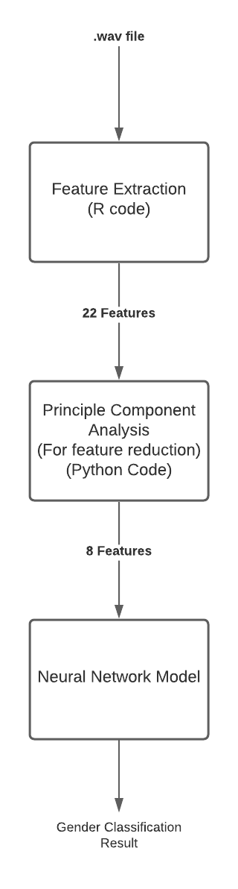
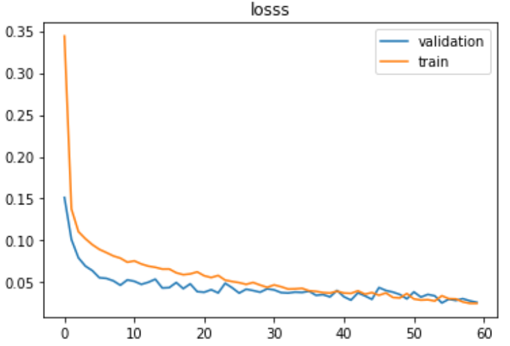
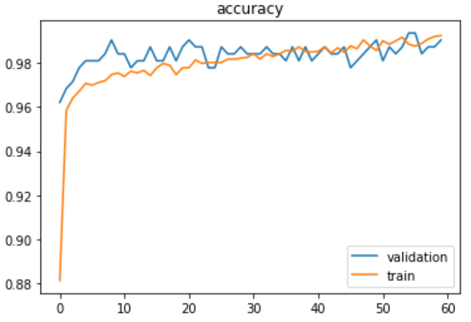

# DL-for-gender-voice-classification
Numerous voice-recognition applications depend on the paralinguistic information contained in the speech of the human voice. Detecting the gender of the human voice is one of the most critical information for such applications, a task that contains several obstacles. In this repo, we propose a solution to the gender detection problem, employing the power and superiority of deep learning techniques particularly in classification tasks.

## Proposed solution

  
We feed all audio wave files to a feature extractor that produces 22 features for each audio file. This feature extractor applies Fourier transform to the audio signal to extract multiple audio characteristics that include the mean frequency, standard deviation, and median. Next, we apply principal component analysis to those 22 features in order to extract only 8 features (22 features are too much for training). Finally, we train the neural network on those 8 features and utilize it to predict voice gender. An overview of our solution architecture is shown in the picture above.

Dataset
The dataset is composed of 3168 voice records of different male and female speakers. The bounding frequency range is 0-280 Hz. The data was imported from this [Kaggle competition](https://www.kaggle.com/primaryobjects/voicegender). The dataset includes the following acoustic properties:

1. meanfreq: mean frequency (in kHz)
2. sd: standard deviation of frequency
3. median: median frequency (in kHz)
4. Q25: first quantile (in kHz)
5. Q75: third quantile (in kHz)
6. IQR: interquantile range (in kHz)
7. skew: skewness (see note in specprop description)
8. kurt: kurtosis (see note in specprop description)
9. sp.ent: spectral entropy
10. sfm: spectral flatness
11. mode: mode frequency
12. centroid: frequency centroid (see specprop)
13. peakf: peak frequency (frequency with highest energy)
14. meanfun: average of fundamental frequency measured across acoustic signal
15. minfun: minimum fundamental frequency measured across acoustic signal
16. maxfun: maximum fundamental frequency measured across acoustic signal
17. meandom: average of dominant frequency measured across acoustic signal
18. mindom: minimum of dominant frequency measured across acoustic signal
19. maxdom: maximum of dominant frequency measured across acoustic signal
20. dfrange: range of dominant frequency measured across acoustic signal
21. modindx: modulation index. Calculated as the accumulated absolute difference between adjacent measurements of fundamental frequencies divided by the frequency range
22. label: male or female

## Neural Network Architecture
Our neural network consists of 3 dense layers, the first having 100 neurons, the second having 50 neurons, and the last one having 1 neuron. We use 1 Relu activation layer after each of the first 2 dense layers and 1 sigmoid activation layer after the last dense layer. For loss calculation, we use binary cross entropy loss:

Where yi is the ground truth voice label and p(yi) is the network prediction. Finally, we employ backpropagation to compute the gradient of the loss function with respect to the weights of the network to ultimately update the weights and fit the model to the training data.

## Results

The graph below shows the training-validation loss achieved after 60 epochs of training. The training and validation losses saturate after 60 epochs at 0.0214 and 0.0262 respectively.

The graph below shows the training-validation accuracy achieved after 60 epochs of training. The training and validation accuracies saturate after 60 epochs at 99.43% and 99.05% respectively.

We also test the model on 317 unbiased, never-seen-before voice data records that consists of male-female 50-50. The model achieves 98.42% test accuracy. Furthermore, we test this model on a self-made voice record on 1 of our own voices. The model produces correct result (male) as can be seen in the testing code.

## References
[1] Becker, K. (2016, August 26). Gender Recognition by Voice. Kaggle. https://www.kaggle.com/primaryobjects/voicegender.

[2] Becker, | by K. (2021, May 7). Identifying the Gender of a Voice using Machine Learning. Primary Objects. http://www.primaryobjects.com/2016/06/22/identifying-the-gender-ofa-voice-using-machine-learning/.

[3] Buyukyilmaz, M., & Cibikdiken, A. O. (2016). Voice Gender Recognition Using Deep Learning. Proceedings of 2016 International Conference on Modeling, Simulation and Optimization Technologies and Applications (MSOTA2016). https://doi.org/10.2991/msota-16.2016.90

